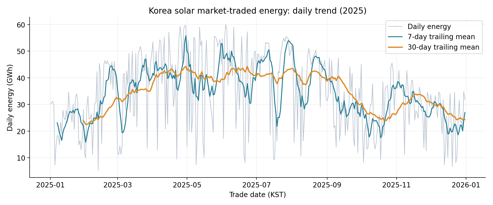
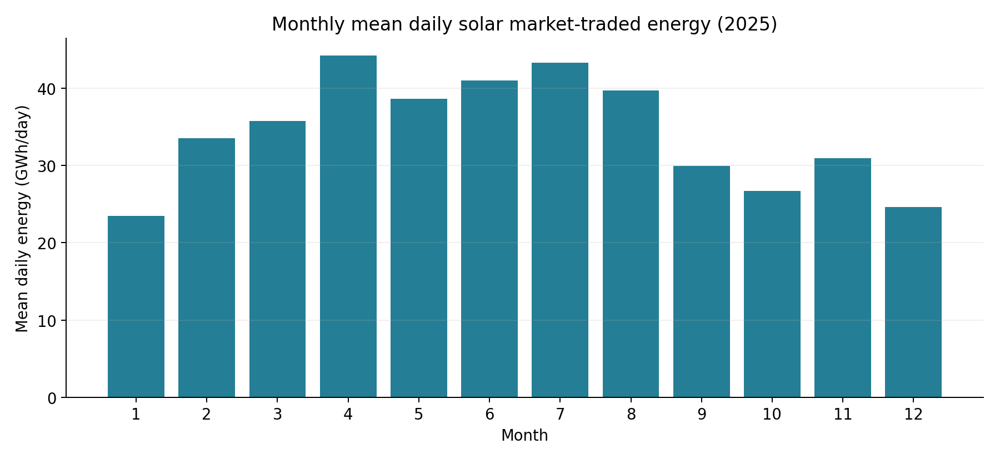
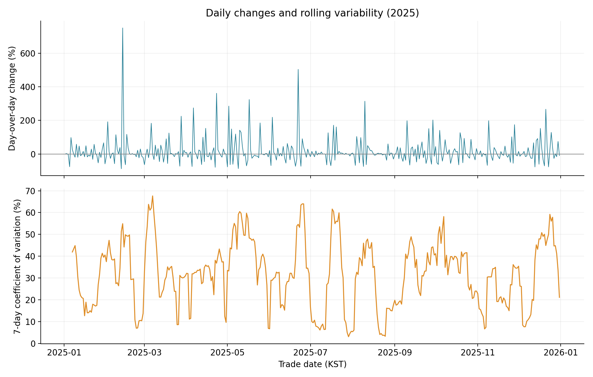

# 한국 태양광 발전량의 시계열 분석: 추세, 계절성 및 변동성 분석

> 분석 범위: KPX 전력시장 참여 태양광 발전기의 전력거래량(ESS 충·방전 포함). 한국 전체 태양광 발전량과 구분해야 합니다.

## 1. 분석 주제 및 선정 이유
태양광 발전량의 시간별 변화를 이해하면 에너지 저장과 전력 수급에서 변동성을 고려해야 하는 이유를 설명할 수 있습니다. 인증 없이 다운로드할 수 있는 공식 KPX 공개자료를 선택했습니다.

## 2. 분석 질문
1. 2025년 일별 발전량과 7일·30일 이동평균은 어떻게 변화하는가?
2. 월별 평균 일발전량은 어떻게 다르며 어느 달이 가장 높고 낮은가?
3. 일별 감소율과 7일 상대 변동성이 가장 큰 시점은 언제인가?

## 3. 데이터 설명
- 제공기관: 한국전력거래소(KPX), 공공데이터포털.
- 출처: [https://www.data.go.kr/data/15065269/fileData.do](https://www.data.go.kr/data/15065269/fileData.do) — 한국전력거래소_지역별 시간별 태양광 및 풍력 발전량_20251231.
- 수집일: 2026-10-03. 원본: `data/kpx_original.csv`(CP949 인코딩), 원본 SHA-256: `3f6f142ded3619a1b6d7d26b8bc8b17d3a9fdf720e68bc26a1d4861dc7e3015b`.
- 분석 기간: 2025-01-01~2025-12-31, 한국 거래일 기준.
- 원본 166,440행 중 태양광 148,920행만 사용. 17개 지역을 합산해 시간별 8,760개, 일별 365개 관측값 생성.
- 실제 컬럼: 거래일, 거래시간, 지역, 연료원, 전력거래량(MWh). 단위는 MWh(1 GWh = 1,000 MWh).
- 날짜는 YYYY-MM-DD로 엄격하게 파싱. 거래시간 1~24는 같은 거래일의 24개 구간으로 취급하며 저장용 구간 시작 시각은 거래시간−1시간으로 표기합니다. 일별 집계는 원본 거래일로 수행합니다.
- 결측값: 태양광 원본 모든 컬럼 0개. 중복(거래일·시간·지역) 0개, 기대하는 날짜×24시간×17지역 조합의 누락 0개. 음수 및 비유한 발전량 0개.
- 이상치: 일별 발전량에 IQR(중간 50% 구간) 1.5배 기준을 적용했습니다. 범위 -9,178.93~78,600.87 MWh 밖의 후보는 0개입니다. 통계적 극단값이 측정 오류를 뜻하지 않으므로 삭제·보간하지 않았습니다. 지역별 시간값은 야간 0과 지역 규모 차이가 정상적이므로 일률적인 IQR 삭제를 하지 않았습니다.
- 이동평균/표준편차의 시작 6일 또는 29일과 변화율의 첫날은 계산에 필요한 이전 값이 없어 비어 있습니다. 원본 결측이 아니며 채우지 않았습니다.
- 한전 직접 거래·자가용 발전기는 제외됩니다. 소내 소비·주변압기 손실을 제외한 송전단 기준이며 수정정산으로 값이 바뀔 수 있습니다. 야간 소량 값은 ESS 방전에 따른 값일 수 있어 보존했습니다.

## 4. 분석 방법
- 일별 합계: 같은 거래일의 모든 지역·24시간 전력거래량을 합산.
- 이동평균: 당일과 이전 6일/29일의 평균. 단기 변화를 완화하고 기간 내 흐름을 확인합니다.
- 월별 집계: 월 합계와 평균 일발전량을 계산. 월별 일수 차이 영향을 줄이기 위해 비교 그래프는 평균 일발전량을 사용합니다.
- 일별 변화율: (당일/전일−1)×100. 야간 0이 많은 시간별 값 대신 양수인 일별 합계에 적용합니다.
- 변동성: 최근 7일 표본 표준편차(ddof=1)와 변동계수(CV=표준편차/평균×100). 발전량 수준이 다른 구간의 상대 변동성을 비교합니다.

## 5. 분석 결과 및 시각화
### 일별 추세

일별 급변과 완만한 흐름을 함께 보기 위한 그래프입니다. 첫 30일 평균은 23.870 GWh/일, 마지막 30일은 24.341 GWh/일로 +1.97% 차이입니다. 양 끝 시점 비교만으로 장기 성장률을 의미하지는 않습니다.

### 월별 패턴

월 길이 차이를 보정한 비교입니다. 최고는 4월 44.272 GWh/일, 최저는 1월 23.476 GWh/일입니다.

### 변화율과 변동성

급격한 일별 변화와 여러 날에 걸친 불안정성을 구분하기 위한 그래프입니다. 최대 감소는 2025-02-12의 -87.39%, 최대 7일 CV는 2025-03-07에 끝나는 구간의 67.63%입니다.

## 6. 인사이트
### 인사이트 1: 기간 내 흐름과 장기 추세는 구분해야 합니다
- 관찰(Fact): 첫 30일 대비 마지막 30일 평균은 +1.97% 차이입니다(그래프 1). 각각 23.870, 24.341 GWh/일입니다.
- 해석(Hypothesis): 계절·기상·설비 규모·시장 참여 변화가 함께 반영될 가능성이 있습니다. 현재 자료로 각각의 영향을 분리할 수 없습니다.
- 의미(Implication): 장기 증가/감소를 판단하려면 여러 해 같은 달과 설비용량을 함께 비교해야 합니다.

### 인사이트 2: 월별 발전량 차이가 큽니다
- 관찰(Fact): 4월 평균은 1월의 1.89배입니다(그래프 2). 최고 44.272, 최저 23.476 GWh/일입니다.
- 해석(Hypothesis): 일조 조건 및 기상과 관련될 가능성이 있지만 기상자료가 없어 원인을 증명하지 못합니다. 1년 자료는 반복 계절성의 증거로 충분하지 않습니다.
- 의미(Implication): 모든 달에 같은 발전량을 가정하기보다 월별 시나리오를 고려하고, 여러 해 자료로 반복 여부를 검증해야 합니다.

### 인사이트 3: 평균만으로 급변을 설명할 수 없습니다
- 관찰(Fact): 2025-02-12 발전량은 전일 42.352에서 5.340 GWh로 -87.39% 감소했습니다. 2025-03-07에 끝나는 7일 구간의 CV는 67.63%로 가장 높습니다(그래프 3).
- 해석(Hypothesis): 기상 변화나 운영 조건 변화 등이 관련되었을 수 있지만, 출력제어·기상·ESS 자료 없이 특정 원인으로 단정할 수 없습니다. 낮은 평균도 CV를 높일 수 있습니다. 가장 큰 증가율은 2025-02-13의 +749.80%이며 전날의 낮은 기준값이 비율을 크게 만들므로 증가율만으로 절대 발전량을 평가하지 않습니다.
- 의미(Implication): 에너지 저장·수급 계획은 평균과 함께 변동 폭을 고려해야 합니다. 이 분석만으로 필요한 배터리 용량이나 공급 부족을 계산할 수는 없습니다.

## 7. 결론
2025년의 월별 차이와 단기 급변을 수치로 확인했습니다. 이동평균은 흐름, 월별 평균은 기간 차이, 변화율·CV는 변동성을 보여줍니다. 분석 대상은 전력시장 참여 설비의 전력거래량이며 전국 총생산량으로 일반화하지 않습니다.

## 8. 한계점
1년으로 반복 계절성이나 장기 추세를 검증할 수 없습니다. 설비용량으로 정규화하지 않았으므로 발전량 증가가 효율 향상을 의미하지 않습니다. 기상·출력제어·ESS·지역별 설비용량을 분석하지 않았고 인과관계를 증명하지 않았습니다. 지역 합계는 지역 간 변동을 완화하며 전국 합계가 개별 발전소 특성을 대표하지 않습니다. 표준편차에는 추세와 계절 변화도 포함될 수 있습니다. 값은 수정정산될 수 있어 원본 파일과 해시를 함께 제공합니다.

## 9. AI 사용 로그
- AI를 사용한 작업: 공식 데이터 출처 탐색, 실제 CSV 컬럼 확인, 전처리·분석 Python 코드 작성, 실행 중 결과 확인, 그래프·보고서·README 작성, 제출 조건 점검.
- AI를 사용한 이유: 초보자의 반복적인 수동 코딩을 줄이고 분석과 제출물을 한 흐름으로 재현하기 위해 사용했습니다.
- 결과 검증 방법: 실제 코드를 실행하여 날짜·시간·지역 전체 조합, 결측·중복·음수를 검사했습니다. 원본 태양광 합계와 시간·일·월 집계 합계가 일치하는지 비교하고 첫 7일 이동평균을 원본 합계로 별도 계산하여 확인했습니다. 생성 PNG와 보고서 상대경로·필수 구조를 자동 확인합니다. 자동 검사 결과는 `data/validation.json`에 기록합니다. `verify.py`로 원본·코드만 별도 빈 폴더에 복사해 결과를 재생성하고 바이트 단위로 비교하며 결과는 `data/reproducibility.json`에 기록합니다. 이는 현재 Python 환경 내 검증이며 다른 운영체제에서 실행한 것은 아닙니다.